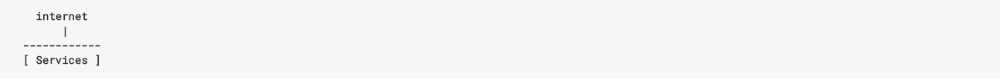
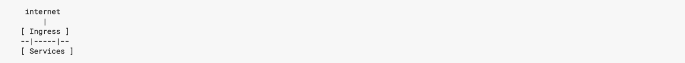

# Nginx ingress安装配置

### What is Ingress?
Typically, services and pods have IPs only routable by the cluster network. All traffic that ends up at an edge router is either dropped or forwarded elsewhere. Conceptually, this might look like:

An Ingress is a collection of rules that allow inbound connections to reach the cluster services.

It can be configured to give services externally-reachable URLs, load balance traffic, terminate SSL, offer name based virtual hosting, and more. Users request ingress by POSTing the Ingress resource to the API server. An Ingress controller is responsible for fulfilling the Ingress, usually with a loadbalancer, though it may also configure your edge router or additional frontends to help handle the traffic in an HA manner.

## 创建自定义ingress镜像

```
# docker pull nginxdemos/nginx-ingress:1.0.0
# mkdir -p /usr/local/docker/ingress
# vim Dockerfile
FROM  nginxdemos/nginx-ingress:1.0.0
MAINTAINER "Cary" <carychen@ageonthtf.com>
ENV container docker
ENV TZ='Asia/Shanghai'
RUN rm -f /etc/localtime
RUN ln -s /usr/share/zoneinfo/Asia/Shanghai /etc/localtime
ADD proxy /etc/apt/apt.conf.d/proxy
RUN apt-get update
RUN apt-get -y install locales
RUN apt-get -y install inetutils-ping lsof
RUN locale-gen en_US.UTF-8
ENV LANG en_US.utf8
RUN rm -rf /etc/apt/apt.conf.d/proxy
# docker build -t registry.aegonthtf.com/template-dev/nginx-ingress:1.0.1 .
# docker images|grep ingress
registry.aegonthtf.com/template-dev/nginx-ingress     1.0.1               b01bc59f425e        3 days ago          167MB
nginxdemos/nginx-ingress                              1.0.0               e6ebf8af9d42        2 months ago        139MB
# docker pull registry.aegonthtf.com/template-dev/nginx-ingress:1.0.1
```

## 创建ingress服务

```
# kubectl create -f ingress-server-secret.yaml
# kubectl create -f nginx-config.yaml
# kubectl create -f nginx-ingress-ds.yaml
# kubectl get pods -o wide|grep ingress
nginx-ingress-controller-cw7sc   1/1       Running   0          3d        10.72.243.229   vm-shalmk03.aegonthtf.com
nginx-ingress-controller-pdpf5   1/1       Running   0          3d        10.72.243.228   vm-shalmk02.aegonthtf.com
nginx-ingress-controller-x8jc9   1/1       Running   0          3d        10.72.243.230   vm-shalmk04.aegonthtf.com
```

## 创建应用

```
# kubectl create -f coffee-svc.yaml
# kubectl create -f coffee-rc.yaml
# kubectl create -f cafe-ingress.yaml
# kubectl get ingress
NAME                    HOSTS                   ADDRESS   PORTS     AGE
cafe-ingress            cafe.aegonthtf.com                80, 443   3d
# kubectl get pods -o wide|grep coffee
coffee-rc-2rbr8                  1/1       Running   0          3d        10.42.0.3       vm-shalmk04.aegonthtf.com
coffee-rc-nw6fg                  1/1       Running   0          3d        10.36.0.3       vm-shalmk03.aegonthtf.com
```

## 测试应用

访问http://cafe.aegonthtf.com/coffee会自动跳转到https


